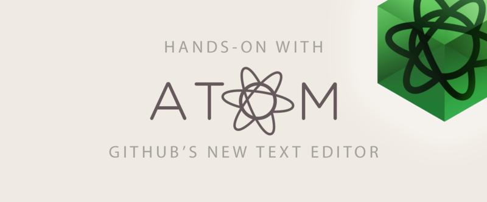

[comment]: # ()
<!---
<p align="center">
  
</p>
-->


# Depot pour CVs/Resumes
* Depot par rapport a la production de CV (resume) par MarkDown.
* Possibilites de versionner les CV (ou sources des CVs).

Ca ressemble beaucoup a ce qu'on peut produire avec LaTex en terme de rapports/documents.

<!---
coommentaire HTML style

-->
[](Commentaire GitHub style)
[comment]: # (This actually is the most platform independent comment)

[comment]: # ()
<!---
<p align="center">
  
</p>
-->


# Editeur pour MarkDown
Pour l'editeur MarkDown, on peut utiliser: [ATOM Text Editor](https://atom.io/)

## Recuperation par PPA Ubuntu 64bits:
```
sudo add-apt-repository ppa:webupd8team/atom
sudo apt-get update
sudo apt-get install atom
```

## Documentations pour MarkDown (via GitHub)
* [Markdown Basics](https://help.github.com/articles/markdown-basics/)
* [GitHub Flavored Markdown](https://help.github.com/articles/github-flavored-markdown/)
* [Writing on GitHub](https://help.github.com/articles/writing-on-github/)
* [Mastering Markdown](https://guides.github.com/features/mastering-markdown/)
* [commentaires en syntaxe markdown](http://stackoverflow.com/questions/4823468/store-comments-in-markdown-syntax)
* [Liens relatifs dans un README.md GitHub - util pour les images](https://help.github.com/articles/relative-links-in-readmes/)
* [How to embed a video into GitHub README.md?](http://stackoverflow.com/questions/4279611/how-to-embed-a-video-into-github-readme-md)
[](http://www.youtube.com/watch?v=4PhNIaQn5Xg)
* [Centrer/Aligner du text/img en MarkDown](https://coderwall.com/p/iftc1q/centered-text-and-images-in-github-markdown)
* [Markdown + Urls with Parentheses](http://ext.raneous.net/post/14580141233/markdown-urls-with-parentheses)
* [pagebreak in markdown while creating pdf](http://stackoverflow.com/questions/22601053/pagebreak-in-markdown-while-creating-pdf)


Installation du package:
sudo apt-get install pandoc-citeproc
Pour la gestion des références.

[Installation du package Debian pour Atom](https://github.com/atom/atom): il y avait des problèmes pour installer les packages par la suite !

Debian Linux (Ubuntu)

Currently only a 64-bit version is available.

* Download atom-amd64.deb from the [Atom releases page](https://github.com/atom/atom/releases/tag/v1.1.0).
* Run sudo dpkg --install atom-amd64.deb on the downloaded package.
* Launch Atom using the installed atom command.

*The Linux version does not currently automatically update so you will need to repeat these steps to upgrade to future releases.*
