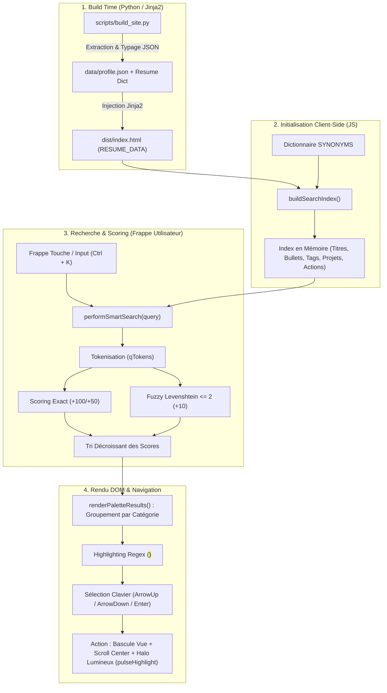

# Architecture du Moteur de Recherche Client-Side (Smart Fuzzy Search)

*Date d'horodatage : 2026-08-29T16:29:00+02:00*  
*Auteur : Lionel ATTY (Antigravity Assistant)*  
*Fichiers sources associés :*
- Template Web : [`site_template/index.html.j2`](../site_template/index.html.j2)
- Script de compilation & Modèle de données : [`scripts/build_site.py`](../scripts/build_site.py)

---

## 1. Vue d'Ensemble & Objectifs

Le CV Web intègre un moteur de recherche instantané style **Spotlight / Raycast** accessible via le raccourci global **`Ctrl + K`** (ou `Cmd + K`).

### Objectifs Clés :
1. **100% Client-Side & Zéro Dépendance Externe** : Exécution instantanée dans le navigateur, sans requête réseau ni backend.
2. **Indexation Profonde & Multi-Sources** : Recherche exhaustive sur les missions professionnelles, projets R&D open-source, compétences, pipelines d'architecture, thèses et actions rapides.
3. **Tolérance aux Fautes de Frappe (Fuzzy Matching)** : Algorithme de distance de Levenshtein ($\le 2$) et matching préfixe/suffixe.
4. **Compréhension Sémantique & Synonymes** : Résolution de termes proches (`llm` $\leftrightarrow$ `mcp`, `claude`, `ia` ; `suckless` $\leftrightarrow$ `suckless-vulkan`, `suckless-ogl`, `suckless-odin`, `suckless-rust`, `rust-firework`).
5. **Expérience Utilisateur Interactive** : Navigation clavier intégrale (`↑`, `↓`, `Entrée`, `Échap`), surbrillance dynamique des termes (`<mark>`) et scroll fluide avec halo lumineux animé (`pulseHighlight`).

---

## 2. Diagramme de Flux Architectural



---

## 3. Détail des Composants Techniques

### 3.1. Structure de l'Index de Données (`buildSearchIndex`)

Chaque document indexé possède le format suivant :

```typescript
interface SearchItem {
  title: string;           // Titre principal affiché
  subtitle?: string;       // Contexte (dates, résumé, catégorie)
  icon: string;            // Emoji ou icône visuelle
  cat: string;             // Catégorie ('Actions', 'Expériences', 'Projets & Talks', 'Compétences', 'Technologies', 'Formation')
  meta?: string;           // Métadonnées affichées à droite (dates, badge)
  keywords: string;        // Ensemble concaténé de tous les textes bruts
  _normalizedKeywords: string; // Mots-clés enrichis des synonymes sémantiques
  action: () => void;      // Callback déclenché à la validation
}
```

### 3.2. Dictionnaire Sémantique & Projets Indexés (`SYNONYMS`)

Le dictionnaire assure des correspondances bidirectionnelles pour toutes les spécialités de Lionel ATTY :

```javascript
const SYNONYMS = {
  // Projets Suckless & Écosystème Bas-Niveau / 3D
  "suckless": ["suckless-vulkan", "suckless-ogl", "suckless-odin", "suckless-rust", "vulkan", "opengl", "c++", "cpp", "odin", "rust", "rendu", "3d", "gpu", "simd", "bas-niveau", "rust-firework"],
  "suckless-vulkan": ["suckless", "vulkan", "opengl", "c++", "cpp", "odin", "rust", "rendu", "3d", "gpu"],
  "suckless-ogl": ["suckless", "opengl", "ogl", "glsl", "shaders", "c++", "cpp", "rendu", "3d", "gpu"],
  "suckless-odin": ["suckless", "odin", "simd", "data-oriented", "rendu", "3d", "gpu", "bas-niveau"],
  "suckless-rust": ["suckless", "rust", "rust-firework", "ecs", "simd", "rendu", "3d", "gpu"],
  "rust-firework": ["firework", "particules", "simulation", "rust", "gpu", "shaders", "volumetric", "lights", "temps-reel", "suckless-rust"],

  // IA Agentique & Tooling
  "llm": ["ia", "ai", "genai", "claude", "mcp", "dust", "n8n", "openai", "gemini", "nlp", "spacy", "gensim", "transformers"],
  "mcp": ["serveurs mcp", "mcp servers", "claude code", "llm", "ia", "context", "tooling"],

  // C++ & Graphismes
  "vulkan": ["suckless", "suckless-vulkan", "3d", "gpu", "rendu", "shaders", "c++", "cpp", "spir-v", "graphics", "opengl"],
  "opengl": ["suckless", "suckless-ogl", "3d", "gpu", "rendu", "shaders", "c++", "cpp", "vulkan", "glsl"],
  "c++": ["cpp", "c11", "c17", "c20", "3d", "gpu", "vulkan", "opengl", "ros", "simd", "performance", "suckless"],

  // SIG & Géomatique
  "sig": ["gis", "postgis", "qgis", "geopandas", "geoalchemy2", "spatial", "carto", "lidar", "ign", "li3ds"],
  
  // Recherche & Thèse
  "these": ["doctorat", "phd", "recherche", "inria", "cgf", "publication", "ombres douces", "shadow maps"]
};
```

---

### 3.3. Algorithme de Calcul de Score (`performSmartSearch`)

La formule de scoring pondérée est calculée pour chaque élément :

$$\text{Score} = S_{\text{exact\_title}} + S_{\text{exact\_kw}} + \sum_{t \in \text{Tokens}} \left( S_{\text{token\_title}}(t) + S_{\text{token\_kw}}(t) + S_{\text{fuzzy}}(t) \right) + S_{\text{bonus}}$$

#### Barème des coefficients :
| Condition de Match | Score attribué |
| :--- | :--- |
| **Sous-chaîne exacte dans le Titre** | $+100$ |
| **Sous-chaîne exacte dans les Mots-clés enrichis** | $+50$ |
| **Token présent dans le Titre** | $+40$ |
| **Token présent dans les Mots-clés** | $+20$ |
| **Fuzzy Match Levenshtein ($\text{dist} \le 2$) ou Préfixe** | $+15 \text{ (préfixe)} \mathbin{/} +10 \text{ (Levenshtein)}$ |
| **Bonus Catégorie / Technologie directe** | $+20$ |

#### Implémentation de la Distance de Levenshtein :
```javascript
function levenshteinDistance(s1, s2) {
  s1 = s1.toLowerCase();
  s2 = s2.toLowerCase();
  const costs = [];
  for (let i = 0; i <= s1.length; i++) {
    let lastValue = i;
    for (let j = 0; j <= s2.length; j++) {
      if (i === 0) costs[j] = j;
      else if (j > 0) {
        let newValue = costs[j - 1];
        if (s1.charAt(i - 1) !== s2.charAt(j - 1)) {
          newValue = Math.min(Math.min(newValue, lastValue), costs[j]) + 1;
        }
        costs[j - 1] = lastValue;
        lastValue = newValue;
      }
    }
    if (i > 0) costs[s2.length] = lastValue;
  }
  return costs[s2.length];
}
```

---

## 4. Rendu Visuel & Interactions Clavier

### 4.1. Navigation & Clavier
- **`Ctrl + K` / `Cmd + K`** : Ouvre / ferme instantanément la palette.
- **`↑` / `↓`** : Modifie l'index de l'élément sélectionné avec scroll automatique (`scrollIntoView({block: 'nearest'})`).
- **`Entrée`** : Déclenche l'action associée à l'élément sélectionné.
- **`Échap`** : Ferme la palette.

### 4.2. Feedback Visuel lors de la Sélection
Lorsqu'un utilisateur sélectionne un résultat (ex: *Mission LetSignIt*, *Projet suckless-vulkan* ou *rust-firework*) :
1. Bascule automatique sur la vue interactive (`switchMainView('web')`).
2. Réinitialisation des filtres de domaine pour rendre l'élément visible.
3. Défilement animé centré vers la carte :
   ```javascript
   el.scrollIntoView({ behavior: 'smooth', block: 'center' });
   ```
4. Déclenchement d'un halo lumineux cyan pulsé pendant 3 secondes :
   ```css
   @keyframes pulseHighlight {
     0% { box-shadow: 0 0 0 2px var(--accent); }
     100% { box-shadow: 0 0 0 6px var(--accent-glow); }
   }
   ```

---

## 5. Projets Personnels et R&D Indexés

| Projet | Technologies | Description & Liens |
| :--- | :--- | :--- |
| **`suckless-vulkan`** | Vulkan 1.x, C++17, RenderGraph DAG, BindGroups, FP16 Bloom, AMD VMA | Moteur Vulkan haute performance, RHI moderne, barrières automatiques, 745+ FPS ([GitHub](https://github.com/yoyonel/suckless-vulkan)) |
| **`suckless-odin`** | Odin Language, OpenGL 4.5/4.6, Cook-Torrance PBR, Compute IBL, Uber-Shader 15 FX, SIMD AVX2 | Moteur PBR en Odin, cross-compilation native Windows AMD64 sans MSVC, Steam Proton ([GitHub](https://github.com/yoyonel/suckless-odin)) |
| **`suckless-ogl`** | C11, POSIX, OpenGL 4.4 Core, Shaders Statiques/Dynamiques, Distrobox clang-dev | Moteur minimaliste en C11 pur, architecture ultra-compacte, clang-tidy, llvm-cov ([GitHub](https://github.com/yoyonel/suckless-ogl)) |
| **`rust-firework`** | Rust, OpenGL AZDO, Audio 3D Spatial (CPAL), Particules GPU, ITD/ILD Binaural | Moteur physique & rendu de particules avec audio spatialisé temps-réel ([GitHub](https://github.com/yoyonel/rust-firework)) |
| **`LI3DS`** | C++, Python, ROS, LIDAR, PostGIS | Acquisition et synchronisation 3D multi-capteurs IGN ([GitHub](https://github.com/LI3DS)) |
