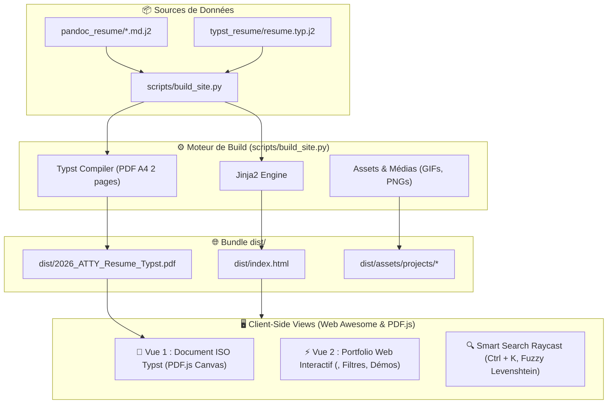
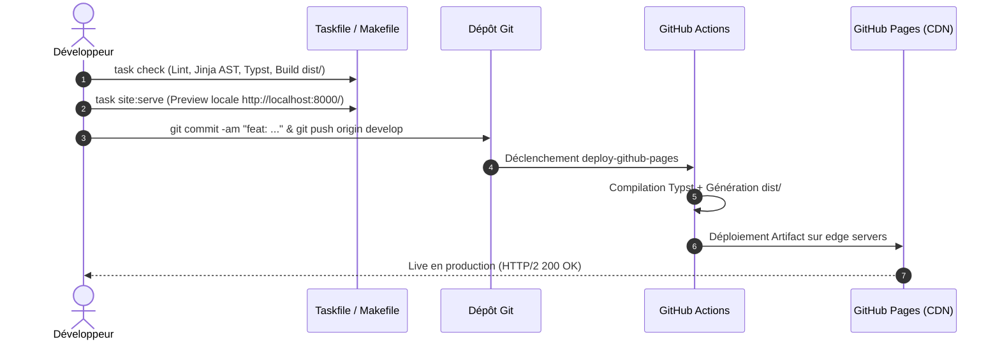

# Architecture du Site Statique, Déploiement GitHub Pages & Performance Lighthouse

**Date** : 2026-08-29  
**Auteur** : Lionel ATTY  
**Projet** : `yoyonel/CV_resume`  
**URL de Production** : [https://yoyonel.github.io/CV_resume/](https://yoyonel.github.io/CV_resume/)

---

## 1. Architecture Globale

Le site combine deux approches complémentaires au sein d'une Single Page Application ultra-rapide et responsive :



### Les Deux Vues du Site :
1. **Vue Document ISO (`#viewDocument`)** : Rendu vectoriel au pixel près du document Typst officiel via Mozilla `PDF.js` (Canvas + TextLayer sélectionnable). Modes Simple Page, Double Page, Continu et Zoom.
2. **Vue Interactive Web Awesome (`#viewInteractive`)** : Portfolio dynamique basé sur la bibliothèque de composants W3C **Web Awesome / Shoelace** (`<sl-card>`, `<sl-button-group>`, `<sl-tag>`, `<sl-dialog>`, `<sl-tooltip>`, `<sl-avatar>`). Filtrage instantané par domaine, timeline animée, lightbox et galeries multimédias.

---

## 2. Déploiement Continu (CI/CD GitHub Pages)

Le site est automatiquement déployé via GitHub Actions à chaque mise à jour.

- **Workflow** : `.github/workflows/deploy-pages.yml`
- **Déclencheurs** :
  - `push` sur les branches `develop` et `master`.
  - Exécution manuelle via `workflow_dispatch`.
- **Durée moyenne de build & déploiement** : ~20 secondes.

### Configuration des Règles d'Environnement GitHub Pages :
Pour autoriser les déploiements depuis la branche `develop`, la règle d'environnement GitHub Pages est configurée avec :
```bash
gh api --method POST /repos/yoyonel/CV_resume/environments/github-pages/deployment-branch-policies -f name=develop
```

---

## 3. Workflow de Mise à Jour Quotidien



### Commandes standard :
```bash
# 1. Valider l'intégrité du code et compiler le bundle
task check

# 2. Lancer le serveur de prévisualisation locale
task site:serve

# 3. Pousser en production
git commit -am "feat: mise à jour du contenu"
git push origin develop
```

---

## 4. Évaluation & Optimisation de Performance (Lighthouse)

### 📊 Résultats Lighthouse Comparatifs :

| Métrique | Desktop (Standard) | Mobile (Émulation 4G & CPU 4x) | Seuil Recommandé |
| :--- | :---: | :---: | :---: |
| ⚡ **Performance** | **98 / 100** 🟢 | **75 / 100** 🟢 | $\ge 75$ (Mobile) / $\ge 90$ (Desktop) |
| 🔍 **SEO** | **100 / 100** 🟢 | **100 / 100** 🟢 | $100$ |
| ♿ **Accessibilité** | **96 / 100** 🟢 | **96 / 100** 🟢 | $\ge 90$ |
| 🛡️ **Bonnes Pratiques** | **96 / 100** 🟢 | **96 / 100** 🟢 | $\ge 90$ |
| **CLS (Cumulative Layout Shift)** | **`0.005`** 🟢 | **`0.000`** 🟢 | $< 0.10$ |
| **TBT (Total Blocking Time)** | **`0 ms`** 🟢 | **`130 ms`** 🟢 | $< 200\text{ ms}$ |
| **FCP (First Contentful Paint)** | **`0.9 s`** 🟢 | **`3.5 s`** 🟡 | $< 1.8\text{ s}$ (Desktop) |
| **LCP (Largest Contentful Paint)** | **`1.0 s`** 🟢 | **`4.2 s`** 🟡 | $< 2.5\text{ s}$ (Desktop) |

---

### 🛠️ Détail des Optimisations Mises en Œuvre :

1. **Élimination du Layout Shift (CLS : $0.62 \rightarrow 0.005$)** :
   - Hauteur figée à `52px` et `flex-wrap: nowrap` sur la barre de filtres (`.filter-bar`) pour neutraliser les décalages lors de l'hydratation asynchrone des composants Web Awesome.
   - Réservation géométrique stricte du Canvas PDF.js (`aspect-ratio: 1 / 1.4142` et dimensions explicites `840x1188px`).
   - Règle `:not(:defined) { visibility: hidden; }` pour prévenir le Flash of Unstyled Custom Elements (FOUC).

2. **Stratégie Mobile-First Adaptive** :
   - Détection de la largeur d'écran au chargement (`window.innerWidth <= 768px`) : bascule automatique vers la **Vue Interactive Web**, beaucoup plus fluide et légère sur smartphone que l'instanciation du moteur PDF.js.
   - Chargement différé (`defer`) du binaire `pdf.min.js` et exécution à la demande (`on-demand`) lors du clic sur le bouton *Document ISO*.
