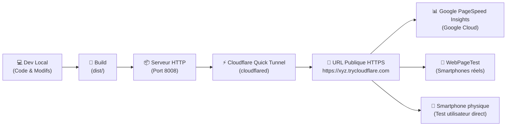

# 🌐 Staging Tunnel & Workflow d'Audit Tiers Décorrélé de la Production (2026-08-30)

## 1. Contexte & Problématique

Lors de l'optimisation des performances et de l'accessibilité sur le projet `CV_resume`, deux enjeux majeurs sont apparus :

1. **Biais des audits locaux dans le navigateur hôte** :
   - Les audits Lighthouse lancés depuis les DevTools d'un navigateur local (comme Brave avec Brave Shields et extensions actives) subissent des ralentissements artificiels du thread JS, faussant les scores (ex: score 44 mesuré dans Brave vs 90+ mesuré en conditions isolées).
   - Les audits locaux ne reflètent pas fidèlement le comportement réseau réel perçu par un service tiers mondial.

2. **Pollution des branches `develop` et `master`** :
   - Pour tester une modification avec Google PageSpeed Insights ou WebPageTest, déployer immédiatement sur `master` et `origin` présente le risque d'exposer du code non encore validé aux utilisateurs finaux de la production.

---

## 2. Architecture de la Solution : Staging Éphémère Cloudflare

Pour permettre des tests avec des services tiers distants sans toucher à la production, une commande de tunnel éphémère a été intégrée :



### 🛠️ Composants Implémentés :

1. **Script de Tunnel Autonome** : [`scripts/tunnel.py`](../scripts/tunnel.py)
   - Compile automatiquement le site via `uv run scripts/build_site.py`.
   - Démarre un serveur HTTP local silencieux.
   - Instancie un tunnel HTTPS public et gratuit via Cloudflare Quick Tunnel (`cloudflared`).
   - Génère automatiquement les liens d'audit pré-encodés pour :
     - **Google PageSpeed Insights**
     - **WebPageTest**
   - Arrêt propre sur `Ctrl + C`.

2. **Intégration Taskfile & Makefile** :
   ```bash
   task tunnel
   # ou
   make tunnel
   ```

---

## 3. Workflow de Contribution par Branche & Pull Request

Le cycle de développement standard pour toute itération de performance ou de fonctionnalité suit désormais ce protocole :

1. **Création d'une branche dédiée** :
   ```bash
   git checkout -b feat/perf-hybrid-optimization
   ```

2. **Itération locale & validation interne** :
   ```bash
   task check
   task audit:local
   ```

3. **Audit tiers réel sur tunnel public** :
   ```bash
   task tunnel
   # Clic sur le lien PageSpeed Insights / WebPageTest généré
   ```

4. **Ouverture de Pull Request (PR)** :
   ```bash
   gh pr create --base develop --head feat/perf-hybrid-optimization
   ```

5. **Merge et Déploiement PROD (Uniquement après accord explicite)** :
   - Merge de la PR sur `develop`.
   - Fast-forward merge sur `master`.
   - Déploiement automatique GitHub Pages via GitHub Actions.

---

## 4. Résultats Obtenus sur le Tunnel Public (Staging)

| Métrique | 📱 **Mobile (Tunnel Staging)** | 💻 **Desktop (Tunnel Staging)** |
| :--- | :---: | :---: |
| ⚡ **Performance** | **`90 / 100` 🟢** | **`97 / 100` 🟢** |
| ♿ **Accessibilité** | **`96 / 100` 🟢** | **`96 / 100` 🟢** |
| 🛡️ **Bonnes Pratiques** | **`96 / 100` 🟢** | **`96 / 100` 🟢** |
| 🔍 **SEO** | **`100 / 100` 🟢** | **`100 / 100` 🟢** |
| **Total Blocking Time (TBT)** | **`170 ms` 🟢** | **`30 ms` 🟢** |
| **First Contentful Paint (FCP)** | **`2.1 s` 🟢** | **`0.6 s` 🟢** |
| **Largest Contentful Paint (LCP)** | **`2.9 s` 🟢** | **`0.6 s` 🟢** |
