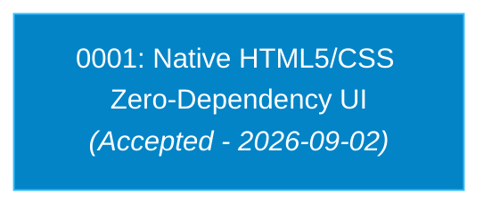

# Écosystème d'Outillage & Visualisation pour Architecture Decision Records (ADR)

**Date :** 2026-09-02  
**Auteur :** Lionel ATTY / Antigravity AI  

---

## 1. Vue d'Ensemble

Les **Architecture Decision Records (ADR)** documentent les choix techniques cruciaux, leur contexte, les alternatives écartées et leurs conséquences à long terme.

Ce document répertorie les outils de référence pour **créer, gérer, visualiser et lier** les ADRs au sein d'un dépôt logiciel.

---

## 2. Outils CLI de Gestion & Cycle de Vie

| Outil | Techno | Description & Commandes Clés |
| :--- | :--- | :--- |
| **[`adr-tools`](https://github.com/npryce/adr-tools)** | Bash / POSIX | **Standard historique (Nygard)**.<br>• `adr init <doc-dir>` : Initialise le répertoire ADR.<br>• `adr new <titre>` : Crée un nouvel ADR numéroté.<br>• `adr link <source> <relation> <target>` : Lie deux décisions (ex: *Supersedes*, *Amends*).<br>• `adr generate graph \| dot -Tpng > graph.png` : Génère un graphe visuel de dépendances Graphviz. |
| **[`pyadr`](https://github.com/adr/pyadr)** | Python | CLI Python dédié au format MADR avec validation de schéma, renumérotation automatique et génération d'index. |
| **[`adrgen`](https://github.com/asiermarques/adrgen)** | Go (Binaire autonome) | CLI moderne et rapide sans dépendance runtime. |

---

## 3. Visualiseurs Web & Dashboards Dédiés

| Outil | Techno | Fonctionnalités & Rendu |
| :--- | :--- | :--- |
| **[`adr-viewer`](https://github.com/mrwilson/adr-viewer)** | **Python** (`pip install adr-viewer`) | **Recommandé pour les projets Python/Taskfile**.<br>Génère une SPA statique épurée avec barre de recherche, badges de statut (*Accepted*, *Proposed*, *Superseded*, *Deprecated*) et vue détaillée de chaque décision.<br>Commande : `adr-viewer --adr-path docs/ --output dist/adr/index.html`. |
| **[`Log4brains`](https://github.com/thomvaill/log4brains)** | Node.js / React | **Le dashboard le plus riche visuellement**.<br>Interface web interactive avec recherche sémantique plein texte, timeline chronologique, graphe interactif des supersessions et mode édition visuelle en local (`log4brains preview`). |
| **[`adr-manager`](https://github.com/adr/adr-manager)** | Web / Electron | Interface graphique guidée facilitant la saisie et le vote de décisions selon le standard MADR. |

---

## 4. Formats et Standards Documentaires

### A. Format Nygard (Standard Classique & Concis)
Format simple et direct en 5 sections :
1. **Title** (`NNNN-titre-court.md`)
2. **Status** (*Proposed*, *Accepted*, *Superseded by NNNN*, *Deprecated*)
3. **Context** (Problème rencontré et contraintes)
4. **Decision** (Solution adoptée)
5. **Consequences** (Bénéfices et compromis acceptés)

### B. Format MADR (Markdown Architectural Decision Records)
Format étendu axé sur la comparaison explicite d'alternatives :
- *Context and Problem Statement*
- *Decision Drivers*
- *Considered Options* (Option 1, Option 2 avec *Pros* & *Cons*)
- *Decision Outcome* & *Validation Plan*
- *Pros and Cons of the Selected Option*

### C. Y-Statements
Formule condensée en une phrase :
> *"Dans le contexte de [besoin/contexte], face à [problématique], nous avons choisi [décision] pour atteindre [qualité/bénéfice], en acceptant [inconvénient/compromis]."*

---

## 5. Intégrations CI, Taskfile & Graphes Mermaid

Pour visualiser l'historique des ADRs sans dépendance lourde, un diagramme Mermaid natif peut être intégré directement dans la documentation Markdown :



### Intégration Taskfile suggérée :
```yaml
  docs:adr:
    desc: "Générer la documentation statique des ADRs via adr-viewer"
    cmds:
      - uv run --with adr-viewer adr-viewer --adr-path docs/ --output dist/adr/index.html
```
