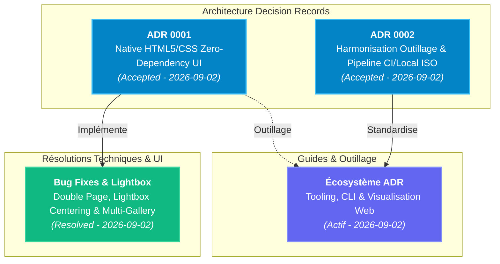

# Documentation Technique & Registre des Décisions d'Architecture (ADR)

Bienvenue dans le répertoire de documentation technique du projet **CV_resume**.

Ce dossier centralise les **Architecture Decision Records (ADR)**, les guides d'outillage et les rapports d'implémentation technique.

---

## 🧭 Graphe des Décisions d'Architecture (Mermaid)

---

## 📋 Registre des Décisions (ADR Index)

| ID | Date | Titre & Lien | Statut | Résumé de la Décision |
| :---: | :---: | :--- | :---: | :--- |
| **0001** | 2026-09-02 | [ADR 0001 : Native HTML5/CSS Zero-Dependency UI](2026-09-02_adr_0001_native_html5_css_zero_dependency_ui.md) | `Accepted` | Remplacement de la dépendance Shoelace (-34.5k LOC) par une UI 100% native HTML5 (`<dialog>`, `<button>`, SVG sprites). |
| **0002** | 2026-09-02 | [ADR 0002 : Harmonisation Outillage & Pipeline CI/Local ISO](2026-09-02_adr_0002_harmonisation_outillage_et_pipeline_ci_local_iso.md) | `Accepted` | Single Source of Truth (`pyproject.toml`), suppression des flags `--with` inline, et exécution `task check` en CI via `arduino/setup-task@v2`. |

---

## 🛠️ Commandes Taskfile pour les ADRs

Le `Taskfile.yml` intègre des commandes dédiées à la gestion des ADRs :

| Commande | Action |
| :--- | :--- |
| `task adr:new -- "Titre de la décision"` | Génère un nouveau fichier ADR numéroté et pré-rempli dans `docs/`. |
| `task adr:build` | Génère la documentation statique navigable des ADRs dans `dist/adr/index.html`. |
| `task adr:serve` | Lance le serveur local interactif de prévisualisation des ADRs sur `http://localhost:8088` (détection automatique du premier port libre). |
| `task adr:list` | Liste tous les ADRs existants avec leur statut. |

---

## 📂 Autres Documents Techniques

- **[2026-09-02_fix_lightbox_gallery_and_double_page_rendering.md](2026-09-02_fix_lightbox_gallery_and_double_page_rendering.md)** : Résolution des régressions Double Page, Lightbox centering, navigation multi-ressources et cache HTTP.
- **[2026-09-02_adr_tooling_and_visualization_ecosystem.md](2026-09-02_adr_tooling_and_visualization_ecosystem.md)** : Étude complète de l'écosystème d'outillage, formats (Nygard, MADR) et visualiseurs web ADR.
- **[2026-08-28_modernisation_cv_typst.md](2026-08-28_modernisation_cv_typst.md)** : Architecture du moteur de rendu Typst et de la charte graphique moderne.
